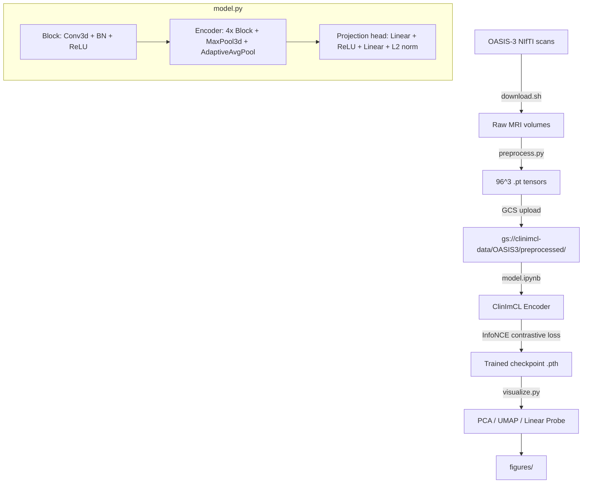

# ClinImCL

Contrastive learning pipeline for longitudinal 3D MRI representation learning on OASIS-3 data. Trains a 3D CNN encoder with InfoNCE loss over temporal scan pairs, producing embeddings evaluated via UMAP trajectories, PCA projections, and linear probe classification.

## Files

| File | Purpose |
|---|---|
| `model.py` | Shared 3D CNN encoder + projection head (`ClinImCL`, `Encoder`, `Block`, `IMG`, `info_nce`, `augment`) |
| `model.ipynb` | Training loop (Colab/GPU, GCS-backed data and checkpoints) |
| `preprocess.py` | MONAI pipeline: NIfTI to 96^3 `.pt` tensors |
| `visualize.py` | Embedding evaluation: PCA, UMAP, cosine stability, linear probe |
| `download.sh` | OASIS-3 MRI downloader (NITRC auth, parallel via tmux) |
| `Makefile` | `make all` validates figures; `make clean` removes caches, cookies, CSVs, and `visualizations/` |
| `test_clinimcl.py` | Test suite: model shapes, L2 norm, InfoNCE loss, augmentation, visualization outputs, label loading, GCS mock, local pipeline, preprocessing e2e, download function tests, error paths |
| `requirements.txt` | Python dependencies (PyTorch, MONAI, nibabel, sklearn, umap-learn, gcsfs, pytest) |
| `figures/` | 8 committed result PNGs (reference outputs from training runs) |
| `.github/workflows/test.yml` | CI: runs pytest and figure validation on push/PR to main |

## Entry Points

| Command | Description |
|---|---|
| `model.ipynb` (Colab) | Train encoder on GCS-hosted preprocessed volumes |
| `python preprocess.py --data_dir /data/OASIS3 --out_dir /data/OASIS3/preprocessed` | Preprocess raw NIfTI scans |
| `python visualize.py --mode gcs --gcs_bucket <path> --epoch 20` | Evaluate embeddings from GCS |
| `python visualize.py --mode local --ckpt <path> --data_dir <path>` | Evaluate embeddings from local .pt files |
| `bash download.sh` | Download OASIS-3 scans (requires `NITRC_USER`, `NITRC_PASS`) |
| `python -m pytest test_clinimcl.py -v` | Run test suite (30 tests) |

## Verification

```bash
python -m pytest test_clinimcl.py -v   # 30 tests: model, loss, augment, viz, GCS mock, local pipeline, preprocessing e2e, download functions
make all                               # confirms all 8 expected figures exist
make clean                             # removes caches, cookies, generated CSVs, visualizations/
```

## Architecture



## Data and Training

- Cloud references: project `clinimcl`, data `gs://clinimcl-data/OASIS3/preprocessed/`, checkpoints `gs://clinimcl-data/checkpoints/`
- OASIS-3 imaging must be obtained under [OASIS](https://www.oasis-brains.org/) terms. This repo does not redistribute scans or patient data.

## Requirements

Python 3.11+. For GPU training, install PyTorch for your CUDA version from [pytorch.org](https://pytorch.org/get-started/locally/) first, then:

```bash
pip install -r requirements.txt
```
